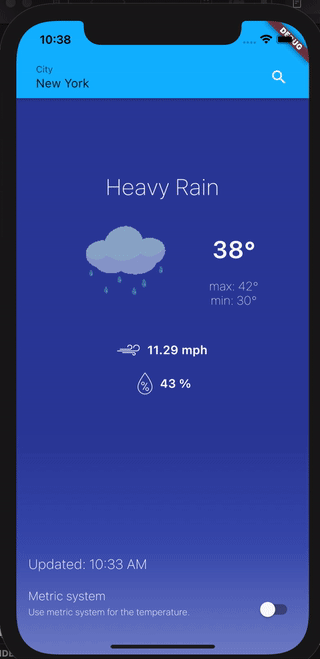

## Getting Started

In order to run the project you need to run:

```sh
sh run.sh
```

You need to have flutter version `2.0.1` installed for successful launch of the app.

After getting all packages and cleaning all modules the script will ask you what flavor do you want to run.

This project contains 3 flavors:

- development
- staging
- production

After selecting the flavor script will ask on what device do you want to run the app.

You can run specific flavors directly by running the following commands:

```sh
# Development
$ flutter run --flavor development --target lib/main_development.dart

# Staging
$ flutter run --flavor staging --target lib/main_staging.dart

# Production
$ flutter run --flavor production --target lib/main_production.dart
```

_\*Vgv Weather App works on iOS, Android, and Web._

UPD: Unfortunately, the web doesn't work due to a missing header in the responses on the backend side.

---

## Architecture

The app implements modulized approach working with business logic and uses BLoC architectural pattern. The app has the following structure:

```
├── core
├── features
│   ├── feature1
│   ├── feature1
│   └── ...
```

Core and each feature are separated flutter packages that have their own set of dependencies, tests, and so on.
Some of the features might have a dependency on the core but all those dependencies go through `pubspec.yaml`

Feature by itself is an entity that holds some business logic. This logic could be described through blocs or cubits from bloc library. In the best case scenario a feature would have a structure like this:

```
├── feature
│   ├── bloc/cubit
│   ├── repository
│   ├── models
│   └── view
```

I think it is pretty self-explanatory. `repository`, `models` or even `view` might not be in the feature. The mandatory part is `bloc/cubit` since it descibses business logic.

---

## Running Tests

To run all unit and widget tests use the following command:

```sh
sh test/run_tests.sh 
```

All tests in the project are spread among the feature modules. Tests structure mimics the feature structure. Meaning, if a feature has the following structure:

```
├── feature
│   ├── cubit
│   └── view
```

Tests for this feature will have the same structure:

```
├── test
│   ├── cubit
│   └── view
```

You can see the test coverage by going to specific feature or core folder and run:

```sh
sh test/coverage.sh
```

It will automatically open a webpage with information about the coverage

---